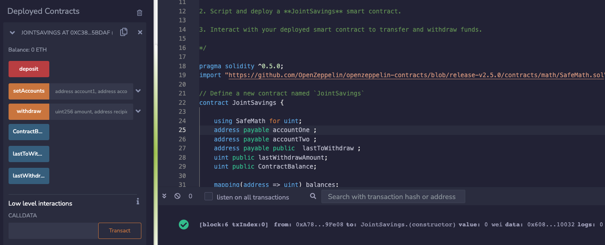
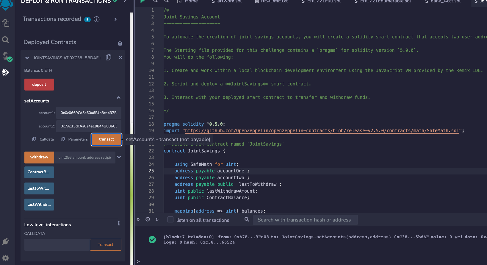
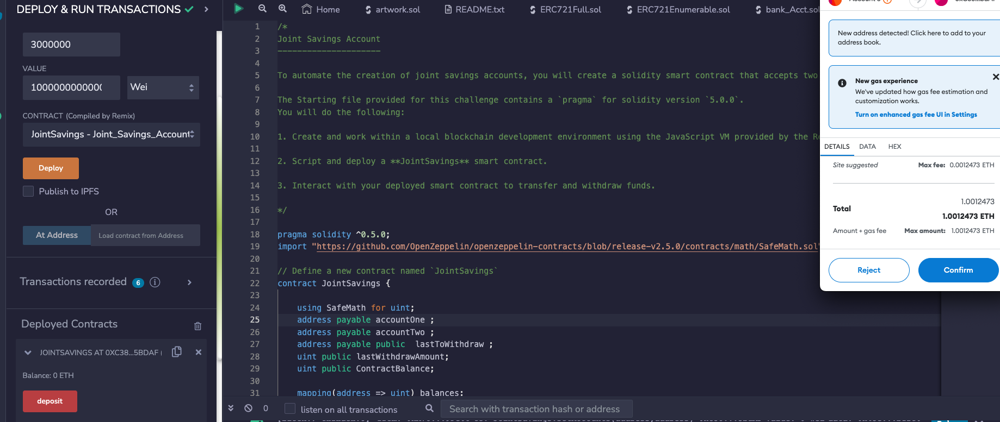
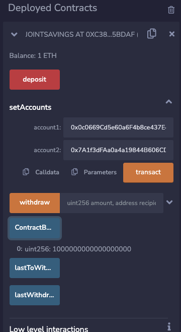
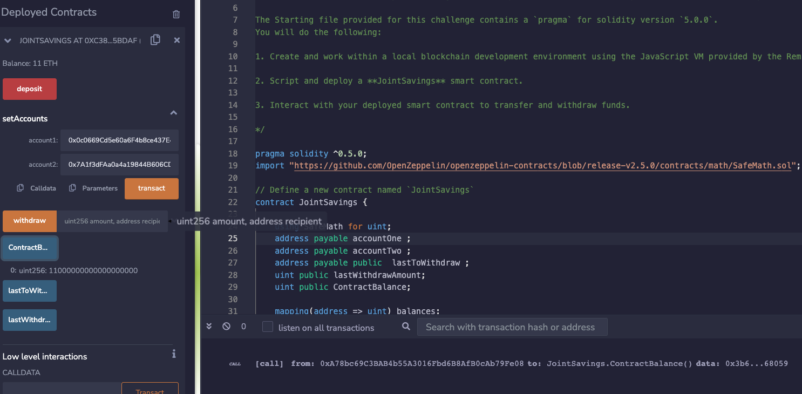
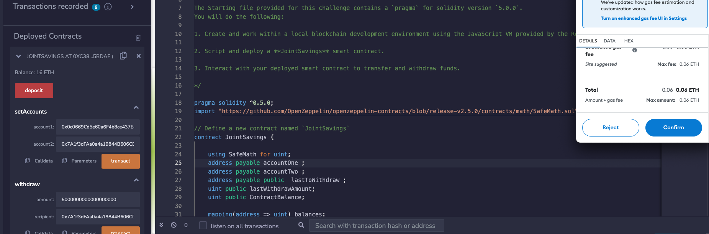
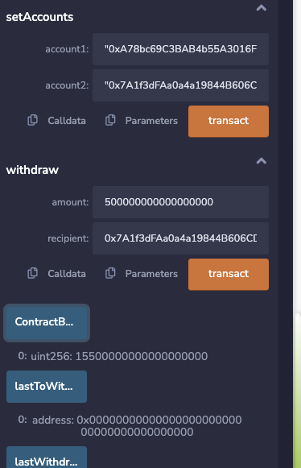
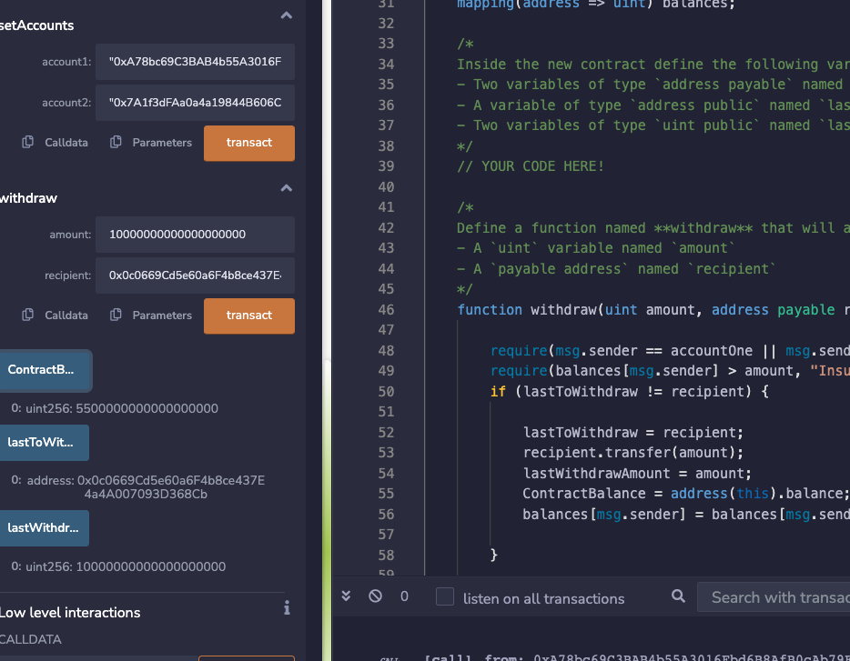
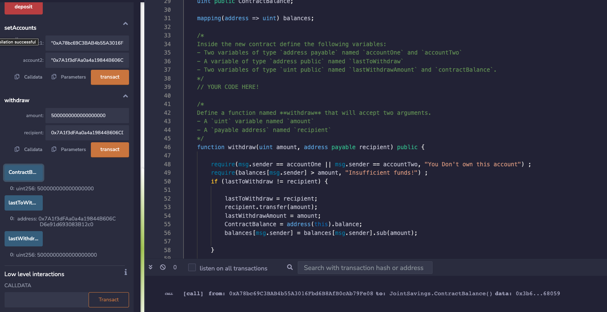

## Solidity

 

###  Smart Contracts
 
Creating Joint Savings Account in Solidity 
 
Executing Deposit and Withdraw to validate contract
 

 
 
 
 
 
 Setting accounts 1 & 2
 

 
 
 
 
 
 Depositing 1ETH in Wei
 

 
 
 
 
 
 Depositing 10ETH 
 

 
 
 
 
 
 Depositing 5ETH 
 

 
 
 
 
 
Error withdrawing 0.5 ETH instead of 5ETH
 

 
 
 
 
 
Withdrawing 10ETH 
 

 
 
 
 
 

 Withdrawing 5ETH 
 

 
 

